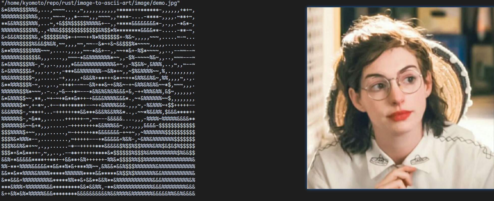

# Intro
A simple demo to convert image to ascii art

## How to use
1. put your images into "image" folder
2. `cargo run -- <your image name>`
    - optional arg is the scale of the ascii art (default value is 64), `cargo run -- <your image name> -w <width(scale)>`

eg.

`cargo run -- demo.jpg`
 

`cargo run -- demo.jpg -w 128`

### Reminder
- make sure that all your images have been put into "image" folder
- when type the image, please *take with the format* of the image, like demo.*jpg*, avator.*png*